# 配置编译内核

## 编译内核

在下载或自行生成目标内核后，则可以开始编译内核。


首先，应用配置文件，通过以下命令应用配置，其中 `sun55i_t527_bsp_defconfig` 对应不同的芯片板级。

```shell
CROSS_COMPILE=aarch64-linux-gnu- ARCH=arm64 make sun55i_t527_bsp_defconfig
```


然后进行内核编译

```
CROSS_COMPILE=aarch64-linux-gnu- ARCH=arm64 make
```

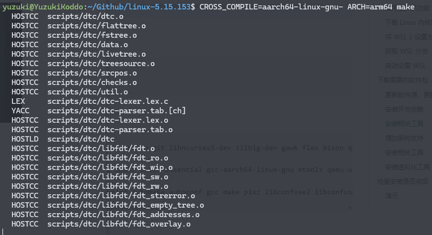

:::info

可以在 `make` 命令后面添加 `-j` 启用多线程编译，例如 `-j4` 为4线程编译，一般选择 CPU 核心数相当的线程数。

```
CROSS_COMPILE=aarch64-linux-gnu- ARCH=arm64 make -j4
```

:::

编译完成，内核编译后的文件位于：`arch/arm64/boot/Image`，设备树位于 `arch/arm64/boot/dts/allwinner` 可以前去拷贝出来。

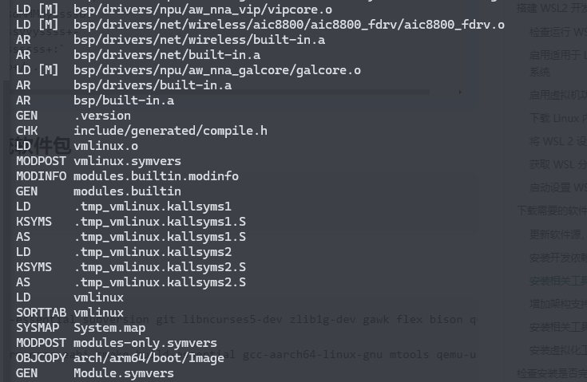

## 配置内核

可以用 `menuconfig` 命令进入内核配置页面

```c
CROSS_COMPILE=aarch64-linux-gnu- ARCH=arm64 make menuconfig
```

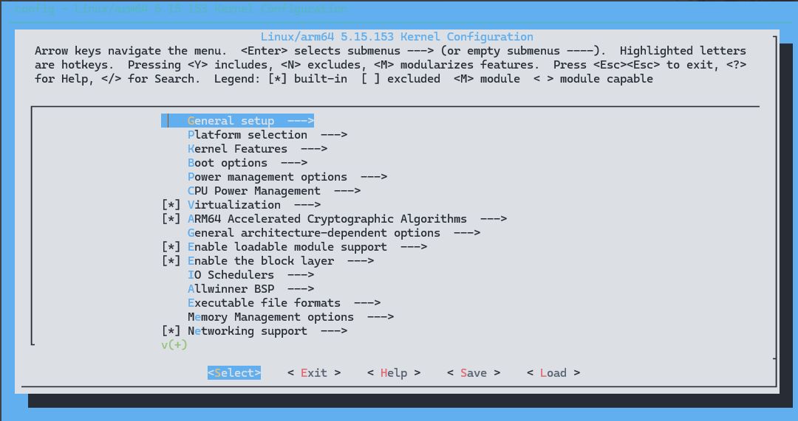

这个界面叫做 kconfig 配置界面，其操作方法如下所示。

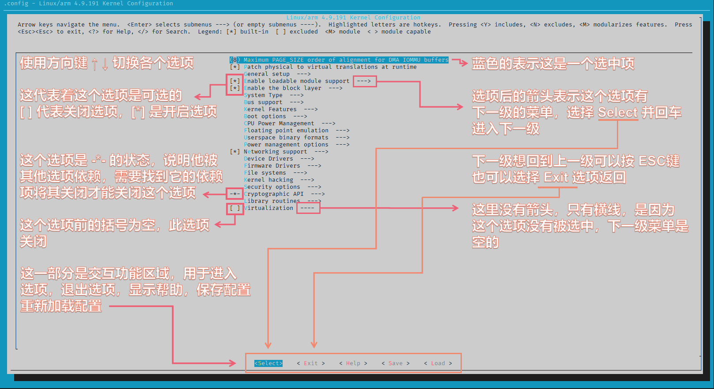

进入常用的 Driver 页面

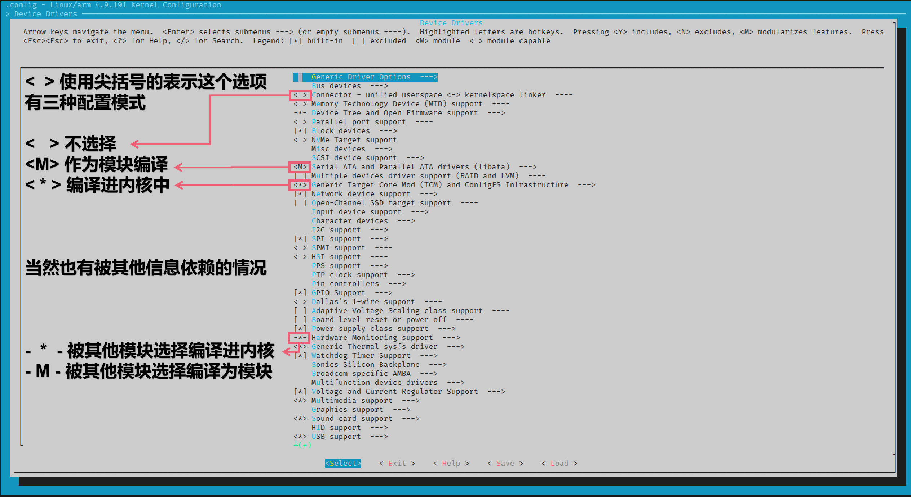

其中，可以使用 `空格键` 选中各个选项，这里以 `Multimedia support` 选项为例：

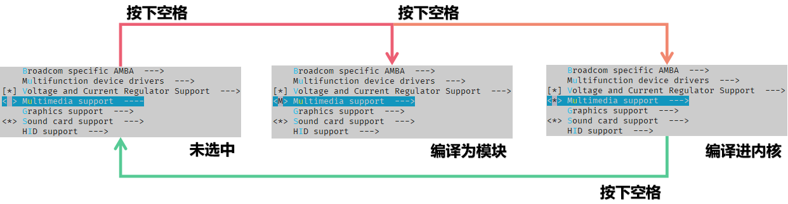

也可以使用 `Y` `M` `N` 键来修改选项：

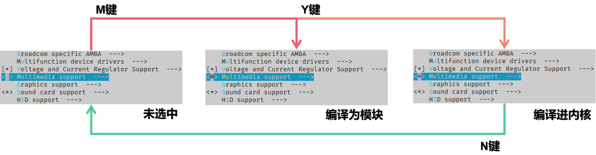

遇到被其他依赖选择的选项，可以查看 Help 页面检查被什么选项所依赖。

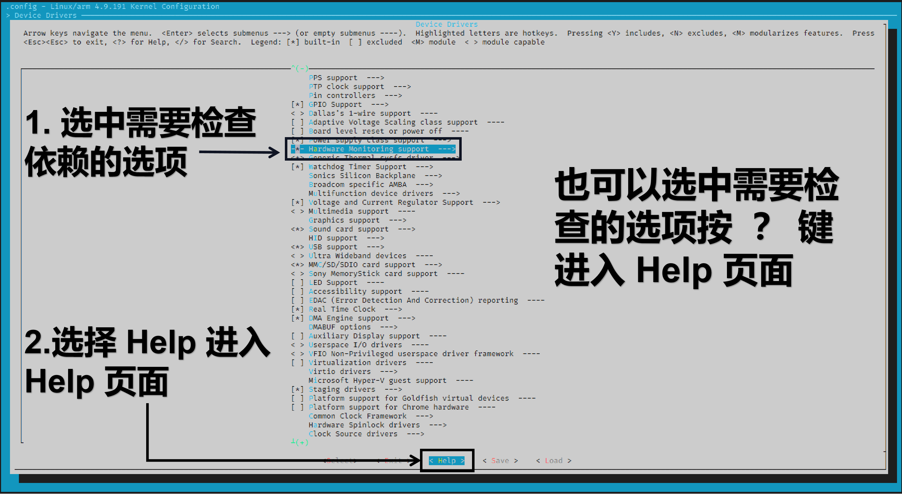

进入 Help 页面后，便可以查看这个选项的依赖情况。需要注意的是，有些选项是作为底层依赖无法随意取消，例如这里示例的 `Hardware Monitoring support` 选项。

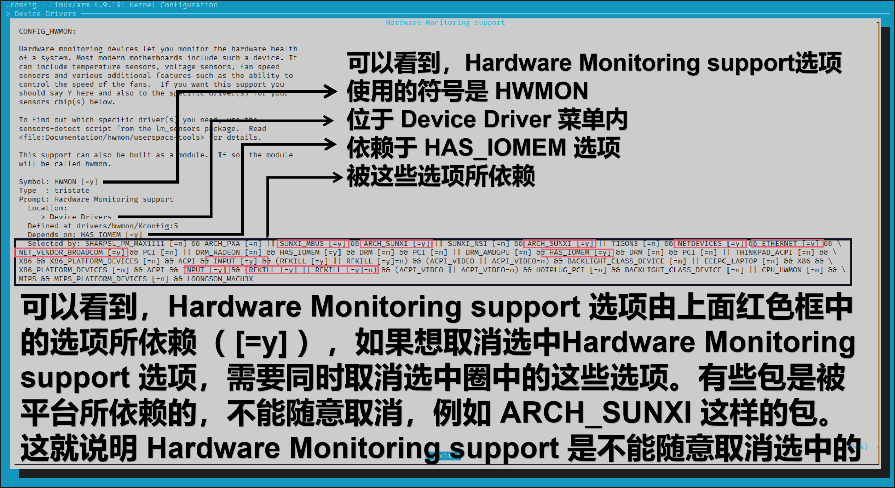

Kconfig 所创建的界面还有一个功能，就是搜索功能，方便快速的找到目标选项。这里以搜索 LCD 屏幕 `icn6202` 驱动为例。

在 Kconfig 的界面中按 `/` 键，进入搜索页面。

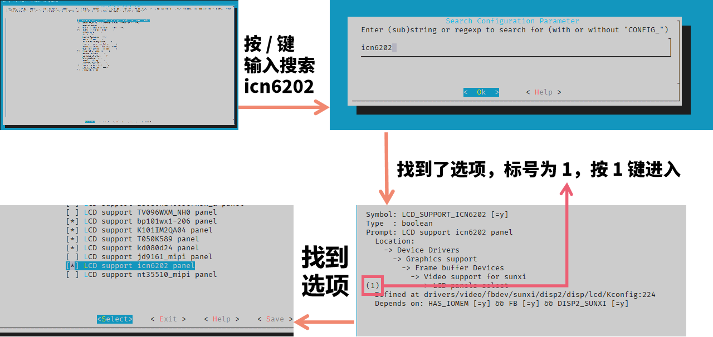

### 保存配置项

修改后需要保存修改到 `defconfig` 里，使用 `savedefconfig` 命令

```
CROSS_COMPILE=aarch64-linux-gnu- ARCH=arm64 make savedefconfig
```

他会保存修改后的 `defconfig` 到目录下

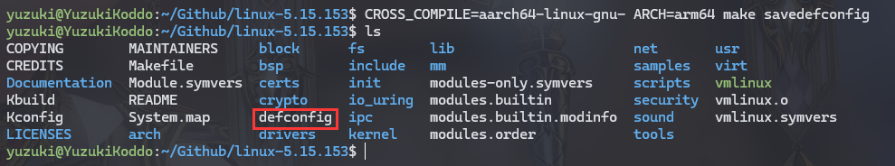

可以将其拷贝回去

```
cp defconfig arch/arm64/configs/sun55i_t527_bsp_defconfig
```

