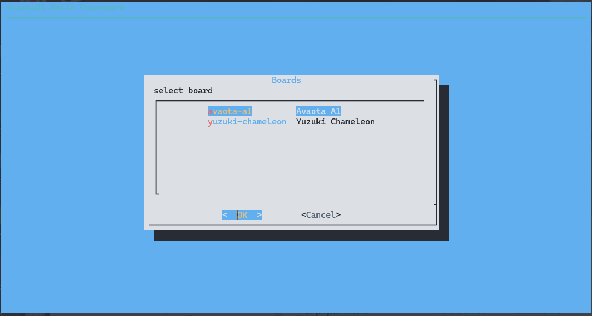
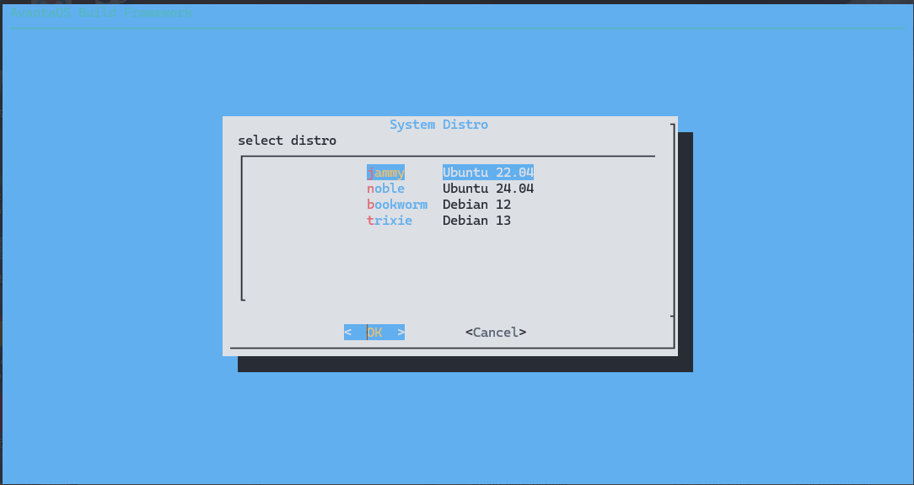
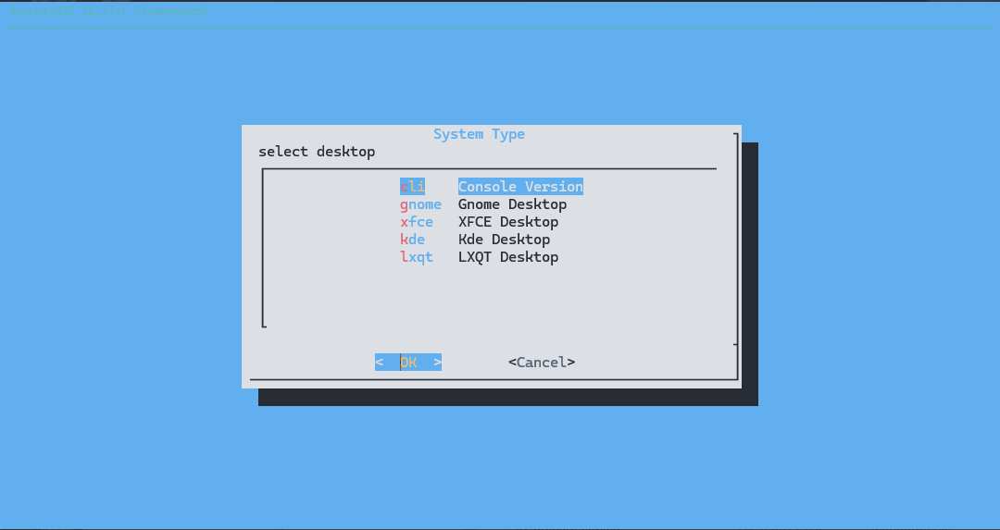
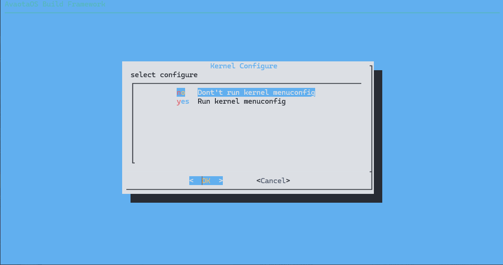
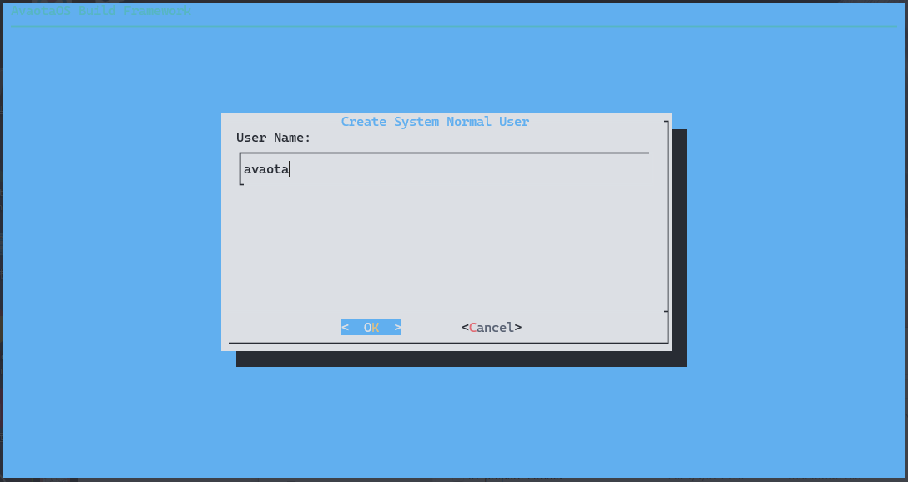
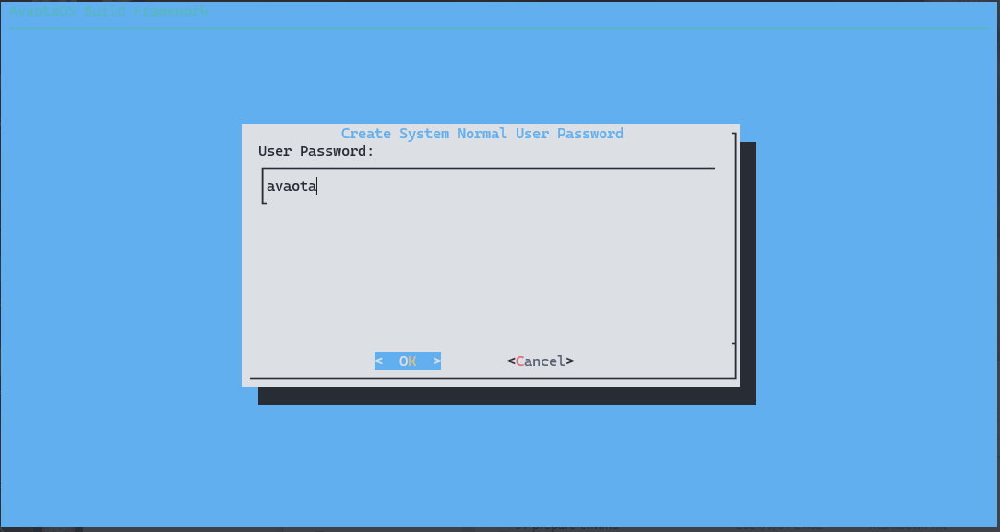
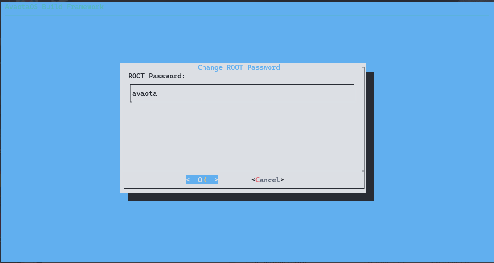
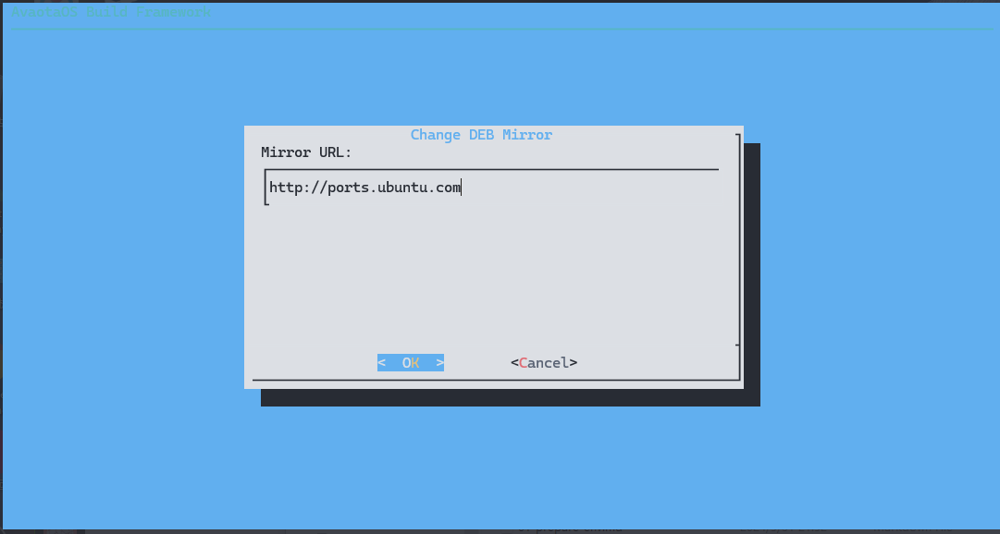
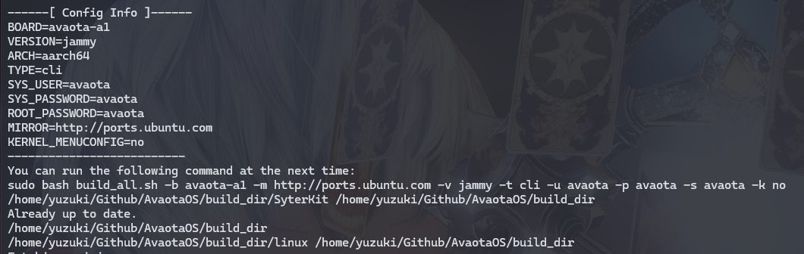

# 编译 AvaotaOS

AvaotaOS 支持 TUI 与 CLI 形式编译，这两种方法都是一样的，TUI 对操作更加友好，而 CLI 更方便集成进各种持续集成服务中。这里分开讲述。

## TUI 编译

在获取 SDK 后，执行下面的命令会进入 TUI 编译模式

```shell
sudo bash build_all.sh
```

首先是选择开发板，这里选择 Avaota A1



然后选择发行版，这里选择 `Ubuntu 22.04 Jammy`



然后选择需要安装的桌面，这里就编译无桌面的 `CLI` 版本



选择是否需要运行内核配置，这里就不配置了



输入默认用户名



输入用户密码



输入 ROOT 用户密码



配置镜像源



之后便开始编译



### 演示

import AsciinemaWidget from '/src/components/AsciinemaWidget';

<AsciinemaWidget src={require('./assets/build-os/os-build-tui.docx').default} rows={30} idleTimeLimit={1} preload={true} />

## CLI 编译

AvaotaOS 的编译命令的格式如下：

```bash
sudo bash build_all.sh -b <BOARD> -v <UBUNTU_VERSION> -a <ARCH> -t <SYS_TYPE>
```

其中，各个选项的含义如下：

- `<BOARD>`：指定要编译的目标板型，例如 `avaota-a1`。
- `<UBUNTU_VERSION>`：指定 Ubuntu 版本，可选值为 `jammy`（Ubuntu 22.04）或者 `noble`（Ubuntu 24.04）。
- `<ARCH>`：指定架构，可选值为 `aarch64`（arm64）或者 `armhf`（armhf）。
- `<SYS_TYPE>`：指定系统类型，可选值包括 `cli`、`xfce`、`gnome`、`kde`、`lxqt`等。

例如，要编译 `avaota-a1` 板型，Ubuntu 22.04，架构为 `aarch64`，系统类型为 `cli`，命令格式如下：

```bash
sudo bash build_all.sh -b avaota-a1 -v jammy -a aarch64 -t cli
```

这样的命令将会使用 `build_all.sh` 脚本进行编译，编译出符合指定要求的系统镜像。编译需要网络连接，依照网络性能和电脑性能大约需要10分钟~120分钟。

编译后的系统镜像在 `build_dir` 里，例如这里示例的编译文件`ubuntu-jammy-cli-aarch64-avaota-a1.img.xz`

### 命令举例

1. 编译 `avaota-a1` 板型，Ubuntu 24.04，架构为 `armhf`，系统类型为 `xfce`：

```bash
sudo bash build_all.sh -b avaota-a1 -v noble -a armhf -t xfce
```

2. 编译 `avaota-a1` 板型，Ubuntu 22.04，架构为 `aarch64`，系统类型为 `gnome`：

```bash
sudo bash build_all.sh -b avaota-a1 -v jammy -a aarch64 -t gnome
```

3. 编译 `avaota-a1` 板型，Ubuntu 24.04，架构为 `armhf`，系统类型为 `kde`：

```bash
sudo bash build_all.sh -b avaota-a1 -v noble -a armhf -t kde
```

### 演示

<AsciinemaWidget src={require('./assets/build-os/os-build.docx').default} rows={30} idleTimeLimit={1} preload={true} />