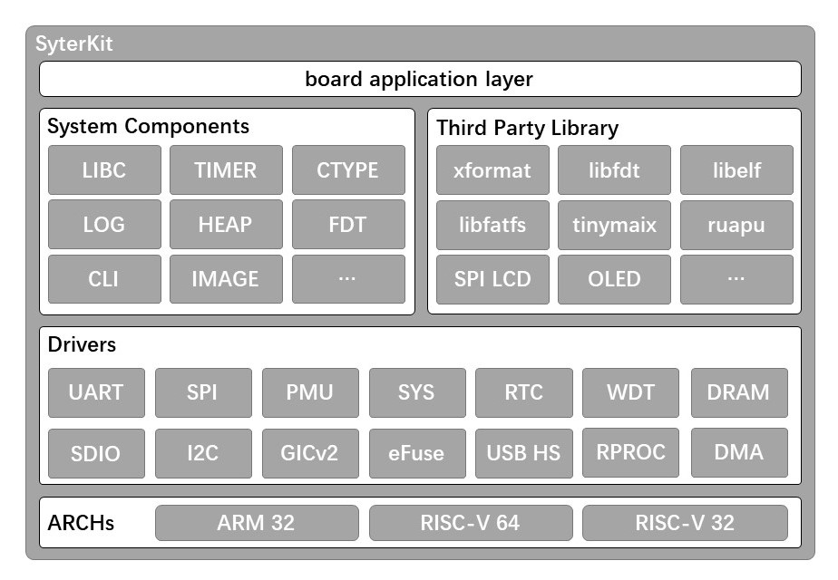
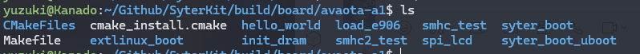

# SyterKit 入门

SyterKit 是一个纯裸机的开发框架，其运行于芯片的SRAM中，由BROM引导的一级程序。SytertKit适用于纯裸机核心开发，操作系统的引导，支持引导 FreeRTOS，RT-Thread，OpenSBI，U-Boot，Linux 内核。SyterKit 提供基础类库，精简的基础libc，以保证在有限的SRAM内实现最多的功能。



SyterKit 开源地址：https://github.com/YuzukiHD/SyterKit

## SyterKit 使用

### 准备开发环境

从头开始构建 SyterKit，首先需要拉取代码：

```
git clone https://github.com/YuzukiHD/SyterKit.git
```

构建 SyterKit 是一个简单的过程，只需要在 Linux 操作系统上配置编译环境即可。SyterKit 所需的软件包包括：

- `gcc-arm-none-eabi`
- `CMake`

对于常用的 Ubuntu 系统，可以使用以下命令进行安装：

```shell
sudo apt-get update
sudo apt-get install gcc-arm-none-eabi cmake build-essential -y
```

然后创建一个文件夹以存储编译输出文件，并进入该文件夹：

```shell
mkdir build
cd build
```

最后，运行以下命令编译 SyterKit：

```shell
cmake -DCMAKE_BOARD_FILE={Board_config_file.cmake} ..
make
```

例如，如果您想为 Avaota-A1 平台编译 SyterKit，您需要使用以下命令：

```bash
cmake -DCMAKE_BOARD_FILE=avaota-a1.cmake ..
make
```

编译后的可执行文件将位于 `build/board/{board_name}/{app_name}`。

SyterKit 项目将编译两个版本：以 `.elf` 结尾的固件适用于 USB 启动，需要通过 PC 端软件进行引导；以 `.bin` 结尾的固件适用于刷写，可以写入存储设备，如 TF 卡和 SPI NAND。

- 对于 SD 卡，您需要刷写 `xxx_card.bin`
- 对于 SPI NAND/SPI NOR，您需要刷写 `xxx_spi.bin`



#### 编译演示

import AsciinemaWidget from '/src/components/AsciinemaWidget';

<AsciinemaWidget src={require('./assets/01-syterkit-intro/syterkit.docx').default} rows={30} idleTimeLimit={1} preload={true} />

## 编译带有调试输出的固件

目前 SyterKit 支持以下几个等级的调试输出，请注意：不同的调试输出等级同时也会影响编译后的固件大小：

```c
#define LOG_LEVEL_MUTE    0
#define LOG_LEVEL_ERROR   1
#define LOG_LEVEL_WARNING 2
#define LOG_LEVEL_INFO    3
#define LOG_LEVEL_DEBUG   4
#define LOG_LEVEL_TRACE   5
```

目前支持指定的模式包括：

- Info

```
cmake -DCMAKE_BOARD_FILE={Board_config_file.cmake} -DCMAKE_BUILD_TYPE=Release ..
```

- Debug

```
cmake -DCMAKE_BOARD_FILE={Board_config_file.cmake} -DCMAKE_BUILD_TYPE=Debug ..
```

- Trace

```
xxxxxxxxxx cmake -DCMAKE_BOARD_FILE={Board_config_file.cmake} -DCMAKE_BUILD_TYPE=Trace ..
```

他会根据选择的等级，选择输出的调试信息。

> 请注意，由于LOG输出是占用CPU时钟的，使用Trace输出等级时可能会导致时序被LOG输出打乱导致外设访问错误，请根据需要选择。

## 创建启动固件

### 创建 TF 卡启动固件

构建完固件后，您可以将其烧录到 TF 卡中。对于 Avaota A1 平台，您可以将其写入 8K 偏移量或 128K 偏移量中。通常，如果 TF 卡使用 MBR 格式，则使用 8K 偏移量进行编写。如果使用 GPT 格式，则使用 128K 偏移量进行编写。假设 `/dev/sdb` 是目标 TF 卡，您可以使用以下命令以 8K 偏移量进行编写：

```shell
sudo dd if=syter_boot_bin_card.bin of=/dev/sdb bs=1024 seek=8
```

如果是 GPT 分区表，则需要使用 128K 偏移量进行编写：

```shell
sudo dd if=syter_boot_bin_card.bin of=/dev/sdb bs=1024 seek=128
```

### 创建 SPI NAND 固件

对于 SPI NAND，我们需要通过将 SyterKit 写入相应位置来创建 SPI NAND 固件：

```shell
dd if=syter_boot_bin_spi.bin of=spi.img bs=2k
dd if=syter_boot_bin_spi.bin of=spi.img bs=2k seek=32
dd if=syter_boot_bin_spi.bin of=spi.img bs=2k seek=64
```

您还可以在固件中包含 Linux kernel 和设备树：

```shell
dd if=sunxi.dtb of=spi.img bs=2k seek=128     # 设备树在第 128 页
dd if=zImage of=spi.img bs=2k seek=256        # 内核在第 256 页
```

使用 xfel 工具将创建的固件刷入 SPI NAND：

```shell
xfel spinand write 0x0 spi.img
```

### 创建 SPI NOR 固件

对于 SPI NOR，我们需要通过将 SyterKit 写入相应位置来创建 SPI NOR 固件：

```shell
dd if=syter_boot_bin_spi.bin of=spi.img bs=2k
dd if=syter_boot_bin_spi.bin of=spi.img bs=2k seek=32
dd if=syter_boot_bin_spi.bin of=spi.img bs=2k seek=64
```

您还可以在固件中包含 Linux kernel 和设备树：

```shell
dd if=sunxi.dtb of=spi.img bs=2k seek=128     # 设备树在第 128 页
dd if=zImage of=spi.img bs=2k seek=256        # 内核在第 256 页
```

使用 xfel 工具将创建的固件刷入 SPI NOR：

```shell
xfel spinor write 0x0 spi.img
```

这个过程将会把固件写入 TF 卡中，使其成为 SyterKit 的可启动设备。

##  创建 USB 引导固件

对于 USB 引导固件，只需要选择elf文件，并通过

```
xfel write <addr> xxx.elf
xfel exec <addr>
```

即可运行。请注意 USB 引导固件的启动地址与标准固件可能有所不同，请在板级的 cmake 文件中查看起始运行地址，或者查看编译后的 `map` 文件。

