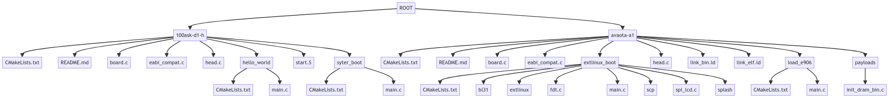

# SyterKit 板级应用

## 板级与应用介绍

SyterKit 在开发过程中遵循的是板级——应用的模式。由于内存资源的有限，以及需要针对实际硬件进行抽象排布，所以模式支持为：在SyterKit支持多个板级，板级下支持多个应用的开发模式。

例如：

- 板级：Avaota A1
  - 应用 `extlinux_boot`
  - 应用 `init_dram`
  - 其他应用...
- 板级：TinyVision
  - 应用 `syter_boot`
  - 应用 `syter_boot_spi`
  - 其他应用...

一个板级对应一个实体板，板级下具有多个应用。

当然，在使用SyterKit的时候，也会遇到板级与板级差别较小，出现应用的混用情况，例如将 Avaota A1 的 `extlinux_boot` 给 LT527X 板级使用。对此 SyterKit 不做任何限制，但是也不推荐这样使用。应该保证每个板级是单独维护的。

## 板级配置文件

SyterKit 使用 CMake 作为编译系统，所以也使用 CMake 作为板级的配置文件。板级文件的配置目录位于：

```
cmake/board
```

除了板级配置，SyterKit 也支持作为 `lib` 编译，目录位于：

```
cmake/lib
```

一个典型的板级配置文件如下：

```cmake
# SPDX-License-Identifier: Apache-2.0

set(CONFIG_ARCH_ARM32 True)
set(CONFIG_ARCH_ARM32_ARM64 True)
set(CONFIG_CHIP_SUN55IW3 True)
set(CONFIG_CHIP_WITHPMU True)
set(CONFIG_CHIP_DCACHE True)
set(CONFIG_BOARD_AVAOTA-A1 True)

set(CONIFG_SPECIAL_LD_PATH  "${CMAKE_SOURCE_DIR}/board/avaota-a1/")

add_definitions(-DCONFIG_CHIP_SUN55IW3) 
add_definitions(-DCONFIG_CHIP_DCACHE)
add_definitions(-DCONFIG_FATFS_CACHE_SIZE=0x2000000)
add_definitions(-DCONFIG_FATFS_CACHE_ADDR=0x60000000)

set(CONFIG_USE_DRAM_PAYLOAD True)
set(CONFIG_USE_PREBUILT_DRAM_PAYLOAD True)
set(CONFIG_USE_DRAM_PAYLOAD_SOURCE_PATH "${CMAKE_SOURCE_DIR}/payloads/sun55iw3_libdram")
set(CONFIG_USE_DRAM_PAYLOAD_BIN_PATH "${CONFIG_USE_DRAM_PAYLOAD_SOURCE_PATH}/output/ddr.bin")
set(CONFIG_USE_DRAM_PAYLOAD_FILE_PATH "${CMAKE_SOURCE_DIR}/board/avaota-a1/payloads/init_dram_bin.c")
set(CONFIG_USE_DRAM_PAYLOAD_SECTION "init_dram_bin")

# Set the cross-compile toolchain
set(CROSS_COMPILE "arm-none-eabi-")
set(CROSS_COMPILE ${CROSS_COMPILE} CACHE STRING "CROSS_COMPILE Toolchain")

# Set the C and C++ compilers
set(CMAKE_C_COMPILER "${CROSS_COMPILE}gcc")
set(CMAKE_CXX_COMPILER "${CROSS_COMPILE}g++")

set(CMAKE_COMMON_FLAGS "-nostdlib -nostdinc -Os -march=armv8.2-a -mthumb-interwork -fno-common -ffunction-sections -fno-builtin -fno-stack-protector -ffreestanding -mthumb -mfpu=neon -mfloat-abi=softfp -pipe")

# Disable specific warning flags for C and C++ compilers
set(CMAKE_C_DISABLE_WARN_FLAGS "-Wno-int-to-pointer-cast -Wno-implicit-function-declaration -Wno-discarded-qualifiers")
set(CMAKE_CXX_DISABLE_WARN_FLAGS "-Wno-int-to-pointer-cast")

set(ARCH_BIN_START_ADDRESS "0x00044000")
set(ARCH_BIN_SRAM_LENGTH "96K")

set(ARCH_FEL_START_ADDRESS "0x00020000")
set(ARCH_FEL_SRAM_LENGTH "128K")

if(NOT CONFIG_USE_PREBUILT_DRAM_PAYLOAD)
    # Create an external project and build it
    ExternalProject_Add(
        init_dram
        PREFIX init_dram
        SOURCE_DIR "${CONFIG_USE_DRAM_PAYLOAD_SOURCE_PATH}"
        INSTALL_COMMAND ""
        CONFIGURE_COMMAND ""
        BUILD_COMMAND make -C ${CONFIG_USE_DRAM_PAYLOAD_SOURCE_PATH}
        BUILD_IN_SOURCE 1
    )

    # Create inital init dram bin file for build
    add_custom_command(
        TARGET init_dram
        POST_BUILD COMMAND ${CMAKE_BIN2ARRAY} ${CONFIG_USE_DRAM_PAYLOAD_BIN_PATH} ${CONFIG_USE_DRAM_PAYLOAD_FILE_PATH} ${CONFIG_USE_DRAM_PAYLOAD_SECTION}
        COMMENT "Generate DRAM LIB Payload ${CONFIG_USE_DRAM_PAYLOAD_BIN_PATH} for ${CONFIG_USE_DRAM_PAYLOAD_FILE_PATH}"
    )
endif()
```

下面通过拆分几个部分，描述板级配置的相关说明：

### 板级配置项

```cmake
set(CONFIG_ARCH_ARM32 True)
set(CONFIG_ARCH_ARM32_ARM64 True)
set(CONFIG_CHIP_SUN55IW3 True)
set(CONFIG_CHIP_WITHPMU True)
set(CONFIG_CHIP_DCACHE True)
set(CONFIG_BOARD_AVAOTA-A1 True)
set(CONIFG_SPECIAL_LD_PATH  "${CMAKE_SOURCE_DIR}/board/avaota-a1/")
```

- CONFIG_ARCH_ARM32
  - 定义当前平台使用的是 ARM32 指令集，a53/a55 等 ARMv8 类处理器若启动状态为ARM32，也需要启用这个宏
- CONFIG_ARCH_ARM32_ARM64
  - 定义当前平台为 ARMv8，支持64位指令集
- CONFIG_CHIP_SUN55IW3
  - 指定目标芯片驱动为SUN55IW3系列
- CONFIG_CHIP_WITHPMU
  - 板级配置需要PMU，增加PMU相关函数
- CONFIG_CHIP_DCACHE
  - 板级配置开启 DCACHE
- CONFIG_BOARD_AVAOTA-A1
  - 板级目标应用目录为 AVAOTA-A1
- CONIFG_SPECIAL_LD_PATH
  - 使用指定的链接器文件，当定义后会选择指定的目录下的 `link_elf.ld` 作为 USB 引导的链接器脚本，`link_bin.ld` 作为刷写引导的链接器脚本。
  - 若不配置，则使用公共链接器脚本生成

更多配置项请参阅 [SyterKit 文档](https://syterkit.yuzukihd.top/)。

### 编译参数

这一部分规定了编译参数设置，其数据将传入编译器参数定义。

```cmake
add_definitions(-DCONFIG_CHIP_SUN55IW3) 
add_definitions(-DCONFIG_CHIP_DCACHE)
add_definitions(-DCONFIG_FATFS_CACHE_SIZE=0x2000000)
add_definitions(-DCONFIG_FATFS_CACHE_ADDR=0x60000000)
```

### DRAM 库配置

这部分由 SyterKit  进行维护配置，不需要用户配置修改。当然，如果平台未使用 DRAM 库而是 DRAM 驱动源码，则没有这部分配置。

```cmake
set(CONFIG_USE_DRAM_PAYLOAD True)
set(CONFIG_USE_PREBUILT_DRAM_PAYLOAD True)
set(CONFIG_USE_DRAM_PAYLOAD_SOURCE_PATH "${CMAKE_SOURCE_DIR}/payloads/sun55iw3_libdram")
set(CONFIG_USE_DRAM_PAYLOAD_BIN_PATH "${CONFIG_USE_DRAM_PAYLOAD_SOURCE_PATH}/output/ddr.bin")
set(CONFIG_USE_DRAM_PAYLOAD_FILE_PATH "${CMAKE_SOURCE_DIR}/board/avaota-a1/payloads/init_dram_bin.c")
set(CONFIG_USE_DRAM_PAYLOAD_SECTION "init_dram_bin")
```

包括后续的 DRAM 库编译脚本，均不需要修改。

```c
if(NOT CONFIG_USE_PREBUILT_DRAM_PAYLOAD)
    # Create an external project and build it
    ExternalProject_Add(
        init_dram
        PREFIX init_dram
        SOURCE_DIR "${CONFIG_USE_DRAM_PAYLOAD_SOURCE_PATH}"
        INSTALL_COMMAND ""
        CONFIGURE_COMMAND ""
        BUILD_COMMAND make -C ${CONFIG_USE_DRAM_PAYLOAD_SOURCE_PATH}
        BUILD_IN_SOURCE 1
    )

    # Create inital init dram bin file for build
    add_custom_command(
        TARGET init_dram
        POST_BUILD COMMAND ${CMAKE_BIN2ARRAY} ${CONFIG_USE_DRAM_PAYLOAD_BIN_PATH} ${CONFIG_USE_DRAM_PAYLOAD_FILE_PATH} ${CONFIG_USE_DRAM_PAYLOAD_SECTION}
        COMMENT "Generate DRAM LIB Payload ${CONFIG_USE_DRAM_PAYLOAD_BIN_PATH} for ${CONFIG_USE_DRAM_PAYLOAD_FILE_PATH}"
    )
endif()
```

### 交叉编译工具链配置

这部分配置了交叉编译工具链，包括使用的工具链名称，编译的 FLAGS，还有禁用的警告。

```cmake
# Set the cross-compile toolchain
set(CROSS_COMPILE "arm-none-eabi-")
set(CROSS_COMPILE ${CROSS_COMPILE} CACHE STRING "CROSS_COMPILE Toolchain")

# Set the C and C++ compilers
set(CMAKE_C_COMPILER "${CROSS_COMPILE}gcc")
set(CMAKE_CXX_COMPILER "${CROSS_COMPILE}g++")

set(CMAKE_COMMON_FLAGS "-nostdlib -nostdinc -Os -march=armv8.2-a -mthumb-interwork -fno-common -ffunction-sections -fno-builtin -fno-stack-protector -ffreestanding -mthumb -mfpu=neon -mfloat-abi=softfp -pipe")

# Disable specific warning flags for C and C++ compilers
set(CMAKE_C_DISABLE_WARN_FLAGS "-Wno-int-to-pointer-cast -Wno-implicit-function-declaration -Wno-discarded-qualifiers")
set(CMAKE_CXX_DISABLE_WARN_FLAGS "-Wno-int-to-pointer-cast")
```

### 链接脚本起始内存定义

这部分定义了链接器脚本对于不同类型的编译目标的起始内存的定义，如果使用 `CONIFG_SPECIAL_LD_PATH` 则此部分无效。

```cmake
set(ARCH_BIN_START_ADDRESS "0x00044000")
set(ARCH_BIN_SRAM_LENGTH "96K")

set(ARCH_FEL_START_ADDRESS "0x00020000")
set(ARCH_FEL_SRAM_LENGTH "128K")
```

- ARCH_BIN_START_ADDRESS
  - 刷写启动的启动地址
- ARCH_BIN_SRAM_LENGTH
  - 刷写启动的可用SRAM大小
- ARCH_FEL_START_ADDRESS
  - USB 启动的启动地址
- ARCH_FEL_SRAM_LENGTH
  - USB启动的可用SRAM大小

## 板级应用目录

板级应用目录位于 `board` 文件夹内，其中以板级为文件夹，内有板级所属的应用。其格式如下：

```
.
├── 100ask-d1-h          # 板级 100ask-d1-h 
│   ├── CMakeLists.txt   # 板级 100ask-d1-h 的编译脚本
│   ├── README.md        # 板级介绍
│   ├── board.c          # 板级公共配置
│   ├── eabi_compat.c    # eabi 兼容函数
│   ├── head.c           # 固件使用启动头
│   ├── hello_world      # 应用 Hello World
│   │   ├── CMakeLists.txt # 应用 Hello World的编译脚本
│   │   └── main.c       # 应用 Hello World的主程序
│   ├── start.S          # 板级启动程序
│   └── syter_boot       # 应用 syter boot
│       ├── CMakeLists.txt # 应用 syter boot 的编译脚本
│       └── main.c       # 应用 syter boot 的主程序
└── avaota-a1            # 板级 avaota-a1
    ├── CMakeLists.txt   # 板级 avaota-a1 的编译脚本
    ├── README.md        # 板级介绍
    ├── board.c          # 板级公共配置
    ├── eabi_compat.c    # eabi 兼容函数
    ├── extlinux_boot    # 应用 extlinux boot
    │   ├── CMakeLists.txt # 编译脚本
    │   ├── bl31          # BL31固件文件夹
    │   │   └── bl31.bin  # BL31固件二进制文件
    │   ├── extlinux      # extlinux配置文件夹
    │   │   └── extlinux.conf  # extlinux配置文件
    │   ├── fdt.c         # FDT（平面设备树）相关代码
    │   ├── main.c        # extlinux boot的主程序
    │   ├── scp           # SCP固件文件夹
    │   │   └── scp.bin   # SCP固件二进制文件
    │   ├── spi_lcd.c     # SPI LCD相关代码
    │   └── splash        # 启动画面固件文件夹
    │       └── splash.bin  # 启动画面固件二进制文件
    ├── head.c            # 固件使用启动头
    ├── link_bin.ld       # 链接二进制文件的链接器脚本
    ├── link_elf.ld       # 链接 ELF 文件的链接器脚本
    ├── load_e906         # 应用 load e906
    │   ├── CMakeLists.txt # 编译脚本
    │   └── main.c        # load e906的主程序
    └── payloads          # 载荷文件夹
        └── init_dram_bin.c  # 初始化 DRAM 的二进制文件
```

其结构如图所示：



