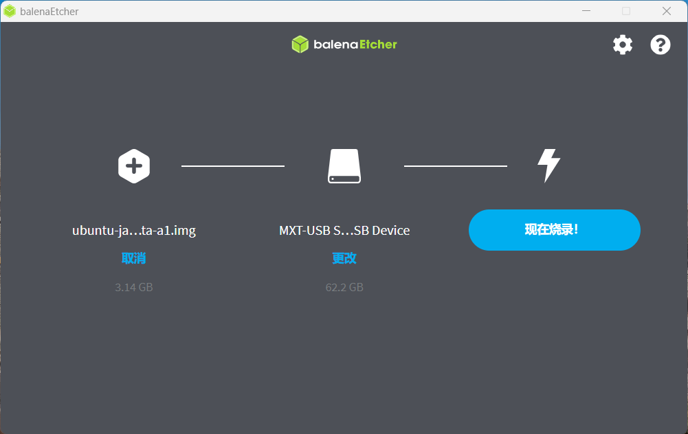
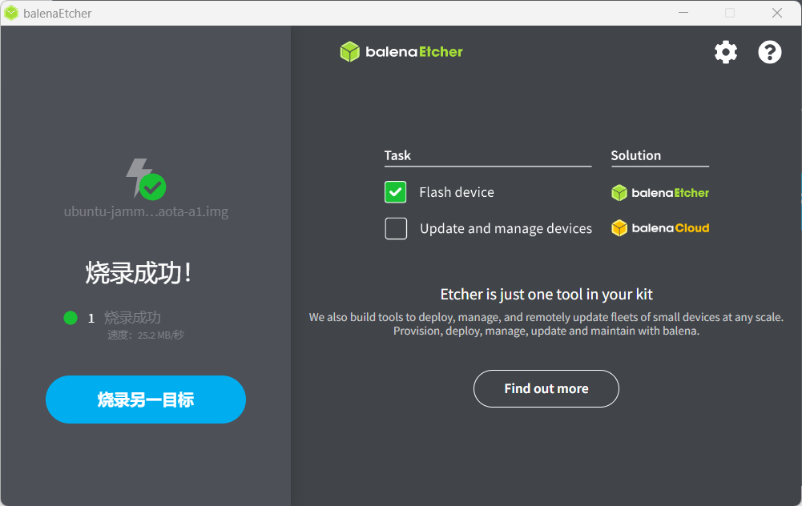
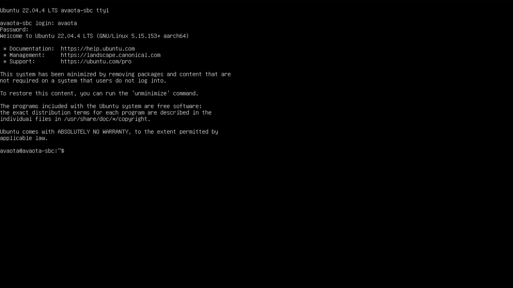
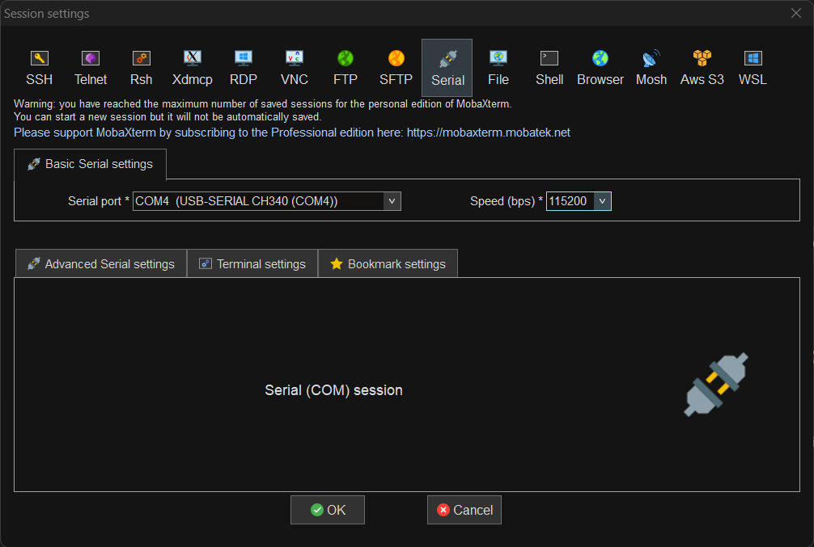
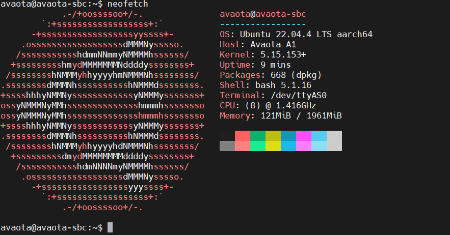

# Flash Firmware

## Installation Ready

### Material preparation

The first materials to be prepared are:

- **SD-Card Formatter**
- **balenaEtcher**
- **Avaota Pi - A1 Board x1**
- **TF-card (not less than 4Gb) x1**
- **12V-DC-Power Adapter x1**
- **TF Reader x1**
- USB TTL Splitter x1 (optional)
- HDMI Gathering Card x1 (optional)
- USB Data Line

### Get operating system image

You need to get an operating system image from Avaota OS and its verification file before installation begins.

- Click to open this link [Releases · Avaota SBC/AvaotaOS (GitHub.com)](https://GitHub.com/AvaotaSBC/AvaotaOS/releases).
- Download the mirror package selected for **ubuntu-jammy-cli-aarch64-avaota-a.img.xz**

## Installation step

1, use SD-Card Formatter format memory card first.

2, Burn to SD card.

3,withdrawn SD card, insert Avaota A1 and power power

## Start Device

### Sign in with Gathering Card

- Username: `avaota`
- Password: `avaota`

**Connect to WIFI using \`\`\` sudo nmtui \`\`, or to _Ethernet_ directly.**

### Sign in with a serial port

- Login with Baud Rate ：`115200`

## FAQ

_A._ Burning failed?

- The downloaded image file is incomplete, make sure that the image **pass the full check**, reformat the SD card, download the image pack and try again.

_B._ Serial cannot read data

- Reconnect the **Type-C line** after reconnecting to see **Orange LED blinwards**.
