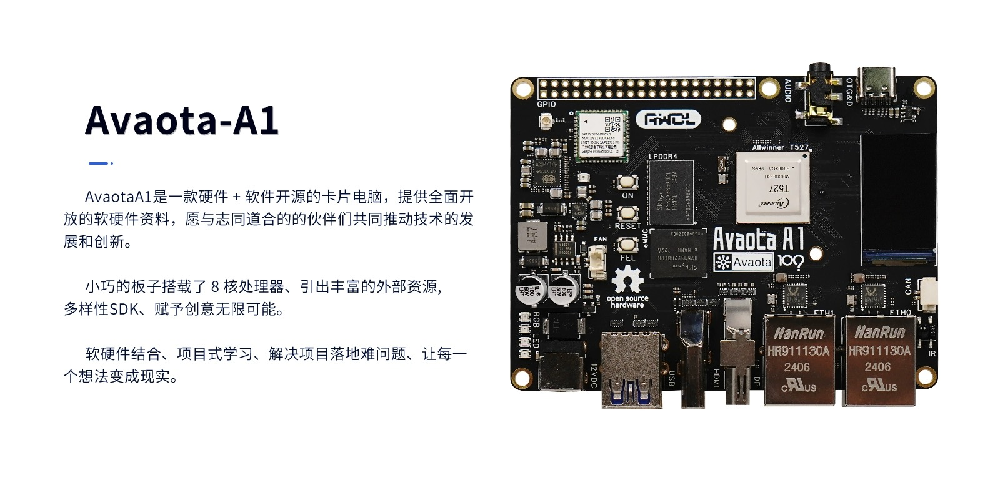
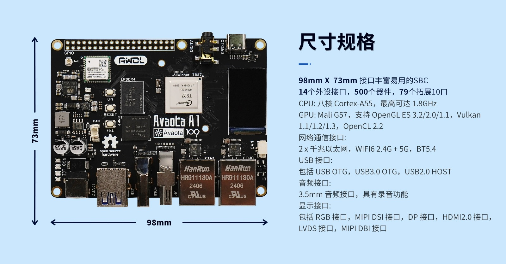
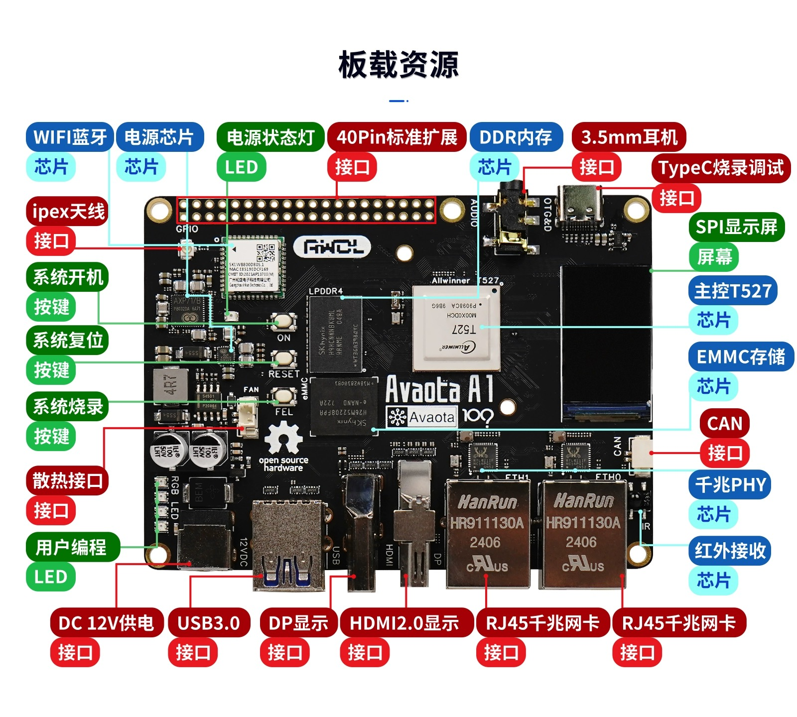
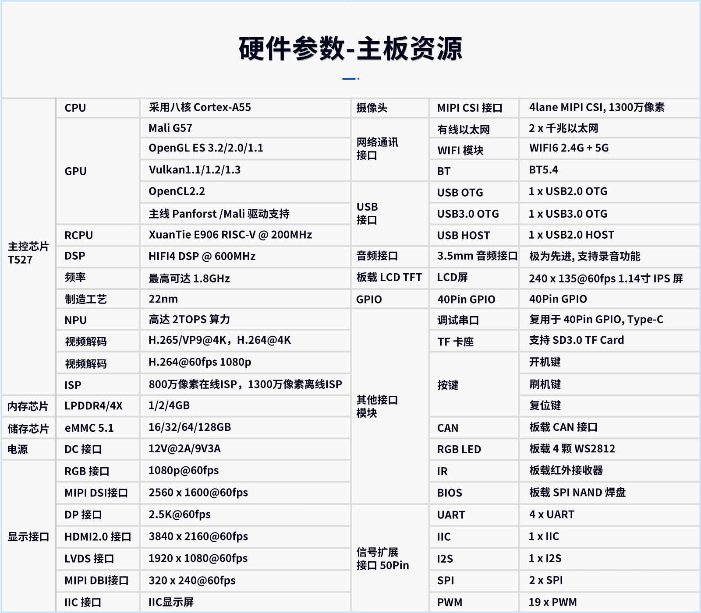
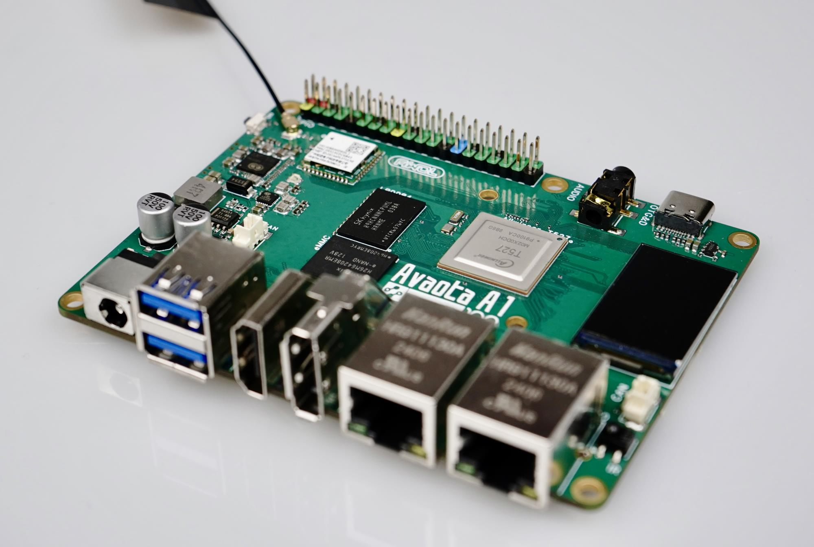
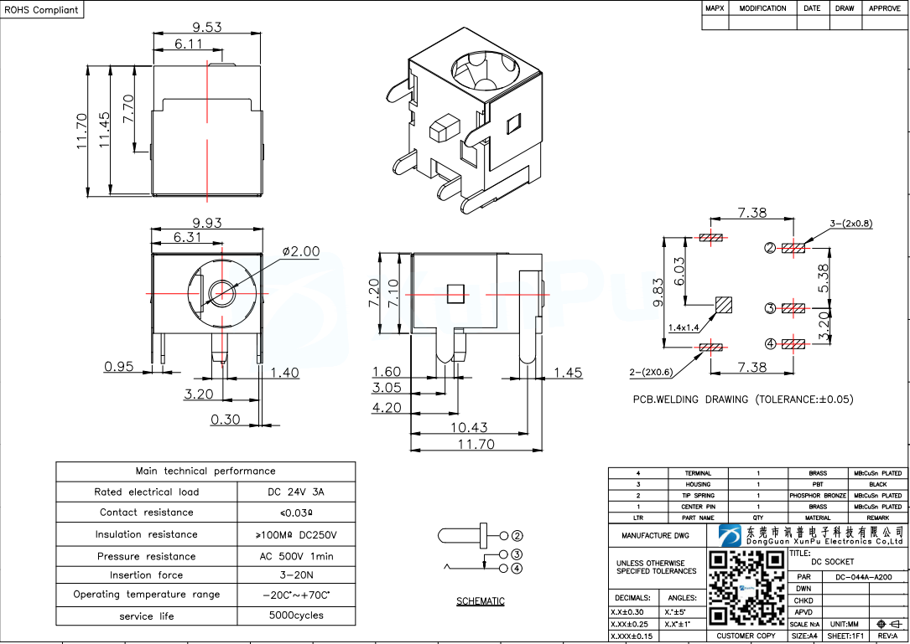
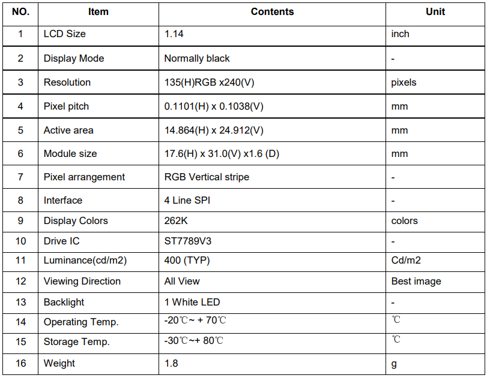
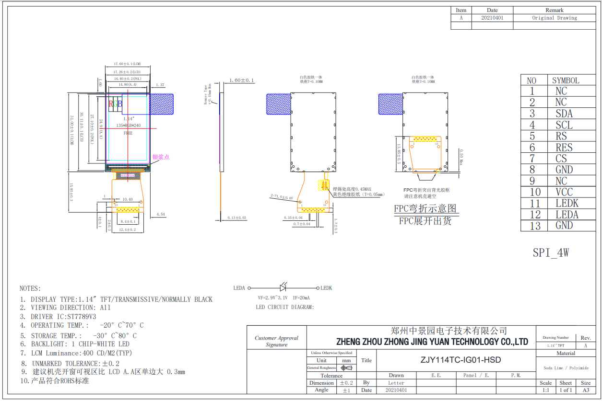
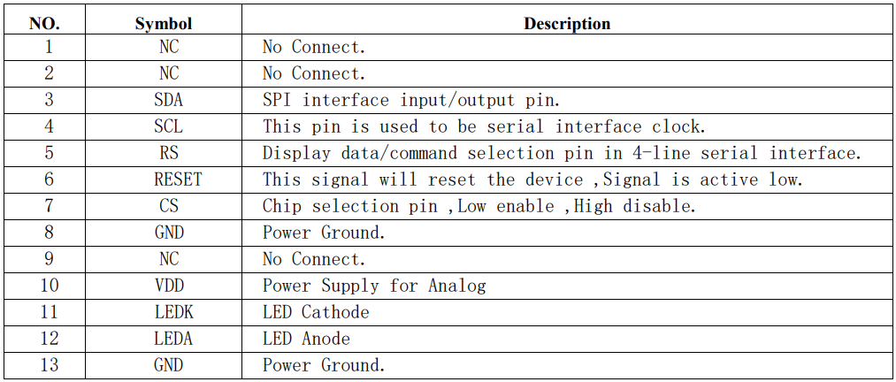
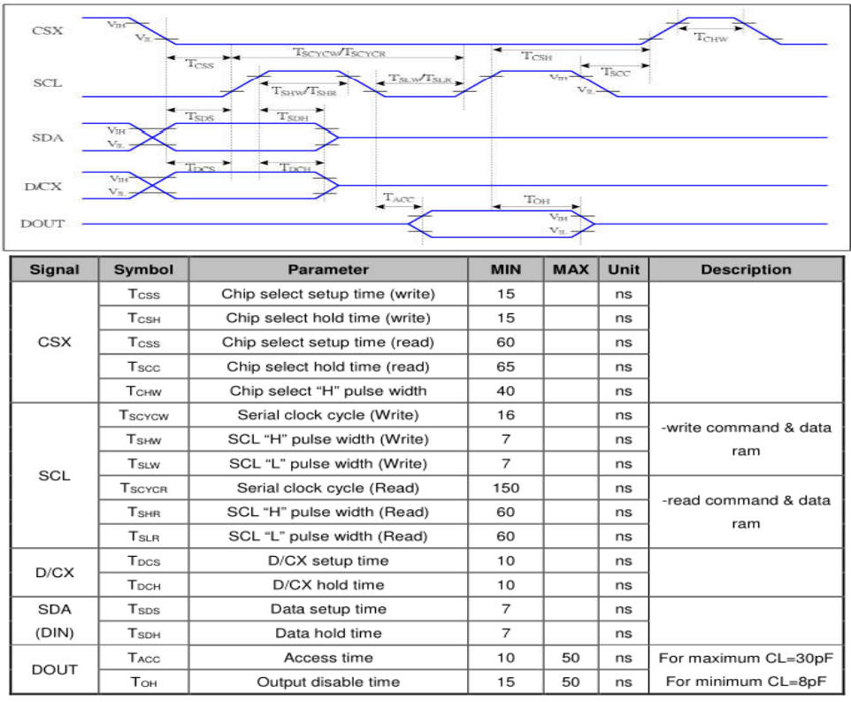

# Hardware parameters









## Specification of parameters

Avaota-A1 - A Powerful SBC with Allwinner T527 Octa-Core A55 SoC



- CPU: Octo Cortex-A55, Highlight 2.0GHz
- GPU: Mali G57, Support for OpenGL ES 3.2/2.0/1.1,Vulkan 1.1/1.2/1.3, OpenCL 2.2
- RCPU: XuanTie E906 RISC-V @ 200MHz
- DSP: HIFI4 DSP @ 600MHz
- NPU: Optionally available for 2TOPS computation
- Memory chip: LPDDR 4, optional 1/2/4 GB
- Storage chip: eMMMC 5.1 support,optional 16/32/64/128GB
- Camera: MIPI CSI interface, which supports 1300 pixels, 4 circuit MIPI CSI
- Network Communication Interface: 2 x gigabytes Ethernet, WIFI6 2.4G + 5 G,BT5.4
- USB interfaces: Includes USB OTG, USSB3.0 OTG, USB2.0 HOST
- Audio interface: 3.5 mm audio interface, with audio recording
- Show interfaces: including RGB interfaces, MIPI DSI interfaces, DP interfaces, HDMI2.0 interfaces, LVDS interfaces, MIPI DBI interface
- Other Interface Modules: Including Debug Series,TF Slot,CAN Interfaces,RGB LED, Infrared (IR),UART,IIC,I2S,SPI,PWM

## Detailed parameters

<table>
   <tbody><tr>
    <td rowspan="14" x:str="">Master chip T527</td>
    <td x:str="">CPU</td>
    <td x:str="">Use of Occurrence Cortex-A55</td>
   </tr>
   <tr>
    <td rowspan="5" x:str="">GPU</td>
    <td x:str="">Mali G57</td>
   </tr>
   <tr>
    <td x:str="">OpenGL ES 3.2/2.0/1.1</td>
   </tr>
   <tr>
    <td x:str="">Vulkan1.1/1.2/1.3</td>
   </tr>
   <tr>
    <td x:str="">OpenCL2.2</td>
   </tr>
   <tr>
    <td x:str="">Panforst/Mali</td>
   </tr>
   <tr>
    <td x:str="">RCPU</td>
    <td x:str="">XuanTie E906 RISC-V @ 200 MHz</td>
   </tr>
   <tr>
    <td x:str="">DSP</td>
    <td x:str="">HIFI4 DSP @ 600MHz</td>
   </tr>
   <tr>
    <td x:str="">Frequency</td>
    <td x:str="">Highest found for 1.8GHz</td>
   </tr>
   <tr>
    <td x:str="">Crafts</td>
    <td x:str="">22nm</td>
   </tr>
   <tr>
    <td x:str="">NPU</td>
    <td x:str="">Up to 2TOPS</td>
   </tr>
   <tr>
    <td x:str="">Video decode</td>
    <td x:str="">H.265/VP94K, H.264K</td>
   </tr>
   <tr>
    <td x:str="">Video encoding</td>
    <td x:str="">H.264@60fps 1080p</td>
   </tr>
   <tr>
    <td x:str="">ISP</td>
    <td x:str="">8 million pixels online ISP,13 million pixels offline ISP</td>
   </tr>
   <tr>
    <td x:str="">Memory chip</td>
    <td x:str="">LDD4</td>
    <td x:str="">1/2/4GB</td>
   </tr>
   <tr>
    <td x:str="">Save chip</td>
    <td x:str="">eMMC 5.1</td>
    <td x:str="">16/32/64/128GB</td>
   </tr>
   <tr>
    <td x:str="">Power</td>
    <td x:str="">DCs Interface</td>
    <td x:str="">12V.2A/9V3A</td>
   </tr>
   <tr>
    <td rowspan="7" x:str="">Show interface</td>
    <td x:str="">RGB Interface</td>
    <td x:str="">1080p@60fps</td>
   </tr>
   <tr>
    <td x:str="">MIPI DSI interface</td>
    <td x:str="">2560 x 1600@60fps</td>
   </tr>
   <tr>
    <td x:str="">DP Interface</td>
    <td x:str="">2.5K@60fps</td>
   </tr>
   <tr>
    <td x:str="">HDMI2.0 interface</td>
    <td x:str="">3840 x 2160@60fps</td>
   </tr>
   <tr>
    <td x:str="">LVDS Interface</td>
    <td x:str="">1920x1080@60fps</td>
   </tr>
   <tr>
    <td x:str="">MIPI DBI interface</td>
    <td x:str="">320 x 240@60fps</td>
   </tr>
   <tr>
    <td x:str="">IIC Interface</td>
    <td x:str="">IIC Display Screen</td>
   </tr>
   <tr>
    <td x:str="">Camera</td>
    <td x:str="">MIPI CSI interface</td>
    <td x:str="">4lane MIPI CSI, 13 million pixels</td>
   </tr>
   <tr>
    <td rowspan="3" x:str="">Network Communication Interface</td>
    <td x:str="">Wired Ethernet</td>
    <td x:str="">2 x gigagen Ethernet</td>
   </tr>
   <tr>
    <td x:str="">WIFI Module</td>
    <td x:str="">WIFI6 2.4G + 5G</td>
   </tr>
   <tr>
    <td x:str="">BT</td>
    <td x:str="">BT5.4</td>
   </tr>
   <tr>
    <td rowspan="3" x:str="">USB interface</td>
    <td x:str="">USB OTG</td>
    <td x:str="">1 x USB 2.0 OTG</td>
   </tr>
   <tr>
    <td x:str="">USB3.0 OTG</td>
    <td x:str="">1 x USB 3.0 OTG</td>
   </tr>
   <tr>
    <td x:str="">USB HOST</td>
    <td x:str="">1 x USB 2.0 HOST</td>
   </tr>
   <tr>
    <td x:str="">Audio Interface</td>
    <td x:str="">3.5 mm Audio Interface</td>
    <td x:str="">Very advanced, recording is supported</td>
   </tr>
   <tr>
    <td x:str="">Board Load LCD TFT</td>
    <td x:str="">LCD Screen</td>
    <td x:str="">240 x 135@60fps 1.14 yun IPS screen</td>
   </tr>
   <tr>
    <td x:str="">GPIO</td>
    <td x:str="">40Pin GPIO</td>
    <td x:str="">40Pin GPIO</td>
   </tr>
   <tr>
    <td rowspan="9" x:str="">Other Interface Module</td>
    <td x:str="">Debug Serial</td>
    <td x:str="">Refer to 40Pin GPIO, Type-C, support</td>
   </tr>
   <tr>
    <td x:str="">TF Card</td>
    <td x:str="">SD3.0, Automatic Consultation</td>
   </tr>
   <tr>
    <td rowspan="3" x:str="">Button</td>
    <td x:str="">Start Key</td>
   </tr>
   <tr>
    <td x:str="">Flush Key</td>
   </tr>
   <tr>
    <td x:str="">Reset Key</td>
   </tr>
   <tr>
    <td x:str="">CAN</td>
    <td x:str="">Board CAN Interface</td>
   </tr>
   <tr>
    <td x:str="">RGB LED</td>
    <td x:str="">Board of Directors 4 at WS2812</td>
   </tr>
   <tr>
    <td x:str="">IR</td>
    <td x:str="">Board Infrared Receiver</td>
   </tr>
   <tr>
    <td x:str="">BIOS</td>
    <td x:str="">Board 128M SPI NAND as BIOS</td>
   </tr>
   <tr>
    <td rowspan="5" x:str="">Signal extension interface</td>
    <td x:str="">UART</td>
    <td x:str="">4 x UART</td>
   </tr>
   <tr>
    <td x:str="">IIC</td>
    <td x:str="">1 x IIC</td>
   </tr>
   <tr>
    <td x:str="">I2S</td>
    <td x:str="">1 x I2S</td>
   </tr>
   <tr>
    <td x:str="">SPI</td>
    <td x:str="">2 x SPI</td>
   </tr>
   <tr>
    <td x:str="">PWM</td>
    <td>19 x PWM</td>
   </tr>
  </tbody></table>
## DC 插孔规格



## 板载 SPI 显示屏

特性



设计图



信号定义



时序参数


初始化代码：

```c
LCD_Set_RES(0);
mdelay(100);
LCD_Set_RES(1);
mdelay(100);

LCD_WR_REG(0x11);
mdelay(120);
LCD_WR_REG(0x36);
LCD_WR_DATA8(0xA0);

LCD_WR_REG(0x3A);
LCD_WR_DATA8(0x05);

LCD_WR_REG(0xB2);
LCD_WR_DATA8(0x0C);
LCD_WR_DATA8(0x0C);
LCD_WR_DATA8(0x00);
LCD_WR_DATA8(0x33);
LCD_WR_DATA8(0x33);

LCD_WR_REG(0xB7);
LCD_WR_DATA8(0x35);

LCD_WR_REG(0xBB);
LCD_WR_DATA8(0x19);

LCD_WR_REG(0xC0);
LCD_WR_DATA8(0x2C);

LCD_WR_REG(0xC2);
LCD_WR_DATA8(0x01);

LCD_WR_REG(0xC3);
LCD_WR_DATA8(0x12);

LCD_WR_REG(0xC4);
LCD_WR_DATA8(0x20);

LCD_WR_REG(0xC6);
LCD_WR_DATA8(0x0F);

LCD_WR_REG(0xD0);
LCD_WR_DATA8(0xA4);
LCD_WR_DATA8(0xA1);

LCD_WR_REG(0xE0);
LCD_WR_DATA8(0xD0);
LCD_WR_DATA8(0x04);
LCD_WR_DATA8(0x0D);
LCD_WR_DATA8(0x11);
LCD_WR_DATA8(0x13);
LCD_WR_DATA8(0x2B);
LCD_WR_DATA8(0x3F);
LCD_WR_DATA8(0x54);
LCD_WR_DATA8(0x4C);
LCD_WR_DATA8(0x18);
LCD_WR_DATA8(0x0D);
LCD_WR_DATA8(0x0B);
LCD_WR_DATA8(0x1F);
LCD_WR_DATA8(0x23);

LCD_WR_REG(0xE1);
LCD_WR_DATA8(0xD0);
LCD_WR_DATA8(0x04);
LCD_WR_DATA8(0x0C);
LCD_WR_DATA8(0x11);
LCD_WR_DATA8(0x13);
LCD_WR_DATA8(0x2C);
LCD_WR_DATA8(0x3F);
LCD_WR_DATA8(0x44);
LCD_WR_DATA8(0x51);
LCD_WR_DATA8(0x2F);
LCD_WR_DATA8(0x1F);
LCD_WR_DATA8(0x1F);
LCD_WR_DATA8(0x20);
LCD_WR_DATA8(0x23);

LCD_WR_REG(0x21);

LCD_WR_REG(0x29);
```
