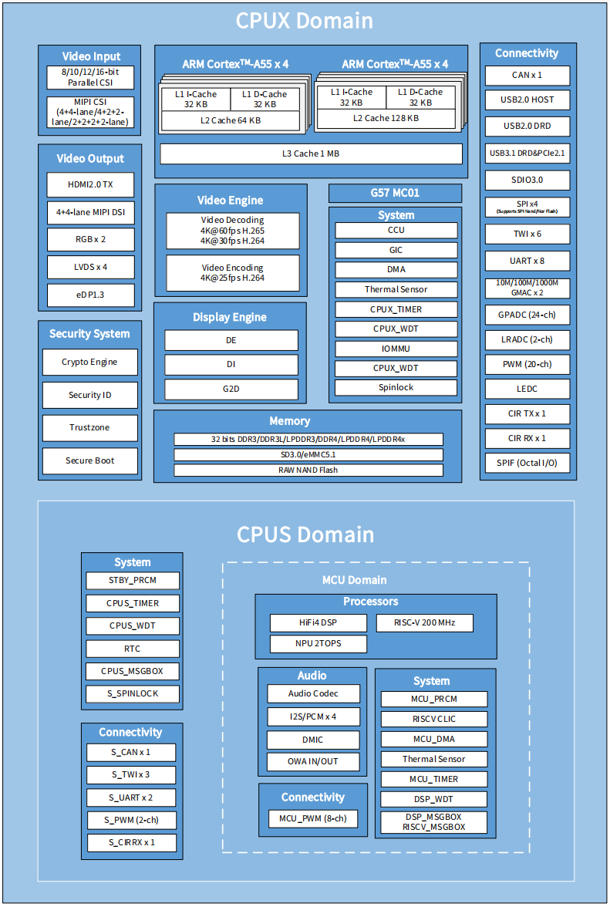
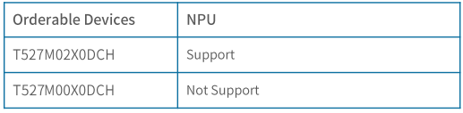

# 处理器参数

Avaota A1 使用的是 Allwinner 的 T527 SoC，其框图如下：

## 处理器（Processor）：

- 八核 ARM Cortex-A55 架构，主频最高可达 2.0 GHz
- RISC-V CPU，主频可达 200 MHz
- HiFi4 音频 DSP
- ARM G57 MC01 GPU
- 最高可达 2 Tops 的 NPU（神经网络处理单元）

## 内存（Memory）：

- 32位 DDR3/DDR3L/LPDDR3/DDR4/LPDDR4/LPDDR4X，最大支持 4GB （32Gb）内存
- 支持 SD3.0/eMMC5.1 接口

## 视频引擎（Video Engine）：

- H.265 MP 和 VP9 解码器，支持最高 4K@60fps 分辨率
- H.264 BL/MP/HP 解码器，支持最高 4K@30fps 分辨率
- H.264 BP/MP/HP 编码器，支持最高 4K@25fps 分辨率
- MJPEG 编码器，支持最高 4K@15fps 分辨率；JPEG 编码器，支持最高 8K x 8K 分辨率

## 视频输出接口（Video Output）：

- 两个双链路 LVDS 接口，支持最高 1080p@60fps 分辨率
- 两个带有 DE/SYNC 模式的 RGB 接口，支持最高 1080p@60fps 分辨率
- DP 1.3 接口，支持最高 2.5K@60fps 和 4K@30fps 分辨率
- 4+4通道 MIPI-DSI 输出接口，支持最高 2.5K@60fps 和 4K@45fps 分辨率
- HDMI2.0 TX 接口，支持 HDCP1.4 加密协议

## 视频输入接口（Video Input）：

- 支持8/10/12/16位并行CSI接口，最高可达4x720P@30fps（BT.656）和4x1080P@30fps（BT.1120）
- 支持4+4通道、4+2+2通道或2+2+2+2通道MIPI CSI接口，每通道最高传输速率为2.0 Gbit/s，在HS传输模式下，符合MIPI-CSI2 V1.1和MIPI DPHY V1.1标准
- MIPI CSI最大视频采集分辨率为8M@30fps

## 音频（Audio）：

- 2个DAC和3个ADC
- 3个音频输出：LINEOUTLP/N、LINEOUTRP/N、HPOUTL/R
- 3个音频输入：MICIN1P/N、MICIN2P/N、MICIN3P/N
- 4个I2S/PCM外部接口：I2S0、I2S1、I2S2和I2S/PCM3
- 最多支持8个数字PDM麦克风（DMIC）
- 一个OWA RX和一个OWA TX，符合S/PDIF接口标准

## 外部外设（External Peripherals）：

- 1个USB2.0主机端口，1个USB2.0 DRD端口，1个USB3.1 DRD&PCIe2.1组合接口
- 2个GMAC（10/100/1000 Mbps端口，带有RGMII和RMII接口）
- 2个CIR RX，1个CIR TX，9个TWI，4个SPI，10个UART，2个CAN
- 30通道PWM，24通道GPADC，2通道LRADC
- SDIO 3.0，LEDC，SPIF（八路I/O）

## 安全系统（Security System）：

- 支持AES、DES、3DES和SM4加密解密算法
- 支持MD5、SHA和HMAC防篡改算法
- 支持RSA、ECC签名和验证算法

## 封装（Package）：

- HS-FCBGA 664balls封装，尺寸为17 mm x 17 mm，球距为0.5 mm，球径为0.3 mm

## 设备区别（Device Difference）

